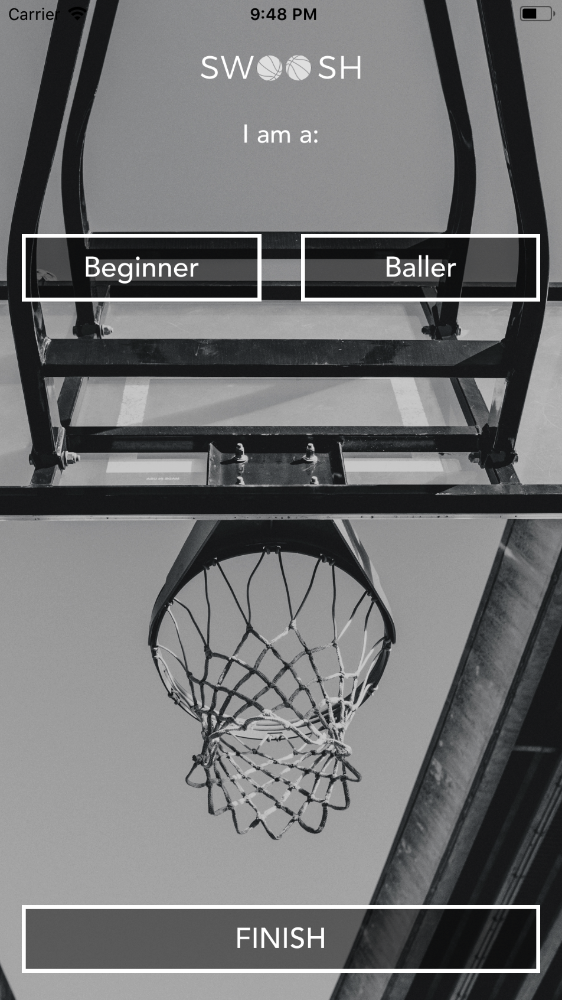

# Swoosh-swift

A simple example using custom views, stack views, segues, unwind, auto layouts and etc

## Getting Started

These instructions will get you a copy of the project up and running on your local machine for development and testing purposes.

### Prerequisites

```
Swift 4
Xcode 9
```




